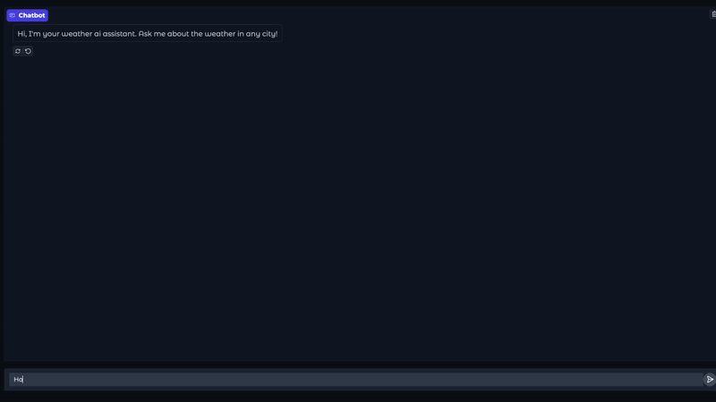
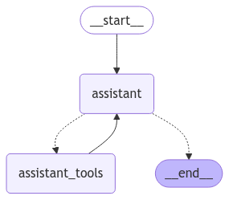

# weather-reporter-ai-agent

An AI-powered weather reporting agent that uses the ReAct (Reasoning + Acting) framework to provide interactive weather information. The agent understands natural language queries and provides contextual weather data through conversation.



## Features

- Natural language understanding for weather queries
- Real-time weather data from OpenWeatherMap API
- Contextual conversation handling
- Docker containerization for easy deployment
- Web interface powered by Gradio




## Table of Contents
- [Setup](#setup)
- [Usage](#usage)
- [Project Structure](#project-structure)
- [Contributing](#contributing)
- [License](#license)
- [Support](#support)

## Setup

### Dependencies
1. You need to install docker and docker-compose prior to running containers.

* [docker](https://www.docker.com/)
* [docker-compose](https://docs.docker.com/compose/install/)

2. The Weather AI reporter agent works with OpenAI for reasoning and OpenWeatherMap API for pulling weather data for a given city. Use the following links to get your API keys.
* [OpenAI API](https://openai.com/index/openai-api/)
* [OpenWeatherMap API](https://openweathermap.org/)


### Installation

1. Clone the repository:
```bash
git clone https://github.com/al-mz/weather-reporter-ai.git
cd weather-reporter-ai
```

2. Set up your environment variables:
```bash
# Create .env file for your API keys
cp ./.envs/.env.example ./.envs/.env
```

3. Set your API keys:
```bash
# For running LLMs hosted by openai (gpt-4o, gpt-4o-mini, etc.)
# Get your OpenAI API key from https://platform.openai.com/
OPENAI_API_KEY=your-openai-api-key

# For getting weather data from OpenWeatherMap
# Get your OpenWeather API key from https://home.openweathermap.org/users/sign_up
OPENWEATHER_API_KEY=your-openweather-api-key
```

4. Run Docker containers using the following docker-compose command:
```bash
docker compose up
```

## Usage
Once docker containers are up and running open your browser of choice and navigate to http://localhost:7860 where gradio app is serving the weather ai reporter interface. Start chatting with the agent.

## Project Structure
```
weather-reporter-ai-agent/
├── .envs/                      # Environment variable configuration
│   ├── .env                   # Production environment variables
│   └── .env.example          # Example environment file template
├── assets/                    # Static assets and images
│   └── workflow_graph.png    # Architecture diagram
├── docker/                    # Docker-related files
│   └── Dockerfile           # Container definition for the application
├── src/                      # Main source code directory
│   ├── agents/              # AI agent implementations
│   │   └── assistant.py    # Main AI assistant logic
│   ├── graph/              # Graph-based processing
│   │   └── state.py       # State management for the agent
│   ├── tools/              # Utility tools and external API integrations
│   │   └── api.py         # API integration implementations
│   ├── utility/            # Helper functions and utilities
│   │   └── utils.py       # Common utility functions
│   └── main.py            # Application entry point
├── .gitignore              # Git ignore rules
├── .pre-commit-config.yaml # Pre-commit hook configuration
├── docker-compose.yml      # Docker services configuration
├── poetry.lock            # Poetry dependency lock file
├── pyproject.toml         # Python project configuration and dependencies
├── README.md             # Project documentation
└── setup.cfg            # Python package configuration
```

## Contributing
1. Fork the repository
2. Create a feature branch
3. Commit your changes
4. Push to the branch
5. Create a Pull Request

## License
This project is licensed under the MIT License - see the LICENSE file for details.

## Support
For support, please open an issue in the GitHub repository.
